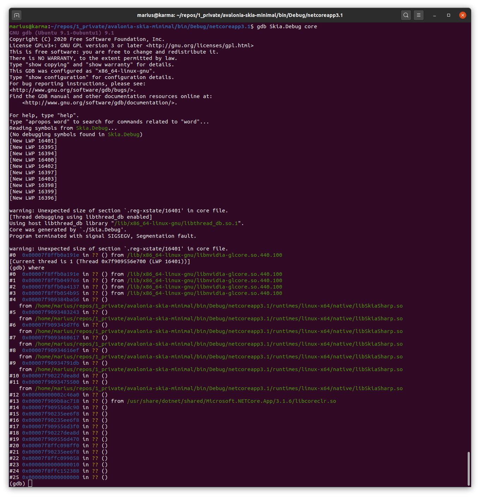

# avalonia-skia-minimal
Minimal example for reproducing the avalonia custom skia control issue.

## Reproduce

Does only occur on Ubuntu 20.04 (with nvidia 440 drivers). Same code works on Windows.

Steps to reproduce:
1. git clone https://github.com/merschformann/avalonia-skia-minimal
1. dotnet build
1. dotnet run
1. echo $? (to show error code 139)

Alternatively, run the executable in bin/... directly.

Output of `gdb Skia.Debug core`:

